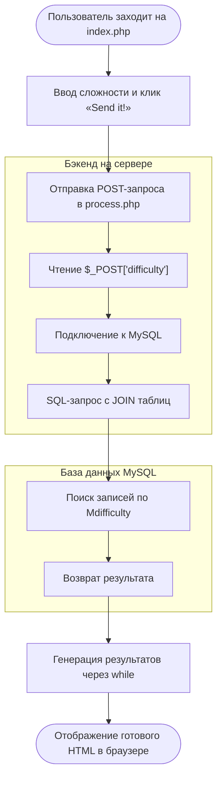

**Block 01: Back-End Programming with PHP**

Practical Work:

* Install Apache server, PHP support and MySQL (Maria DB) DBMS ([https://wampserver.aviatechno.net](https://wampserver.aviatechno.net?utm_source=gemini)).

* Implement the Back-End (two PHP Scripts) that process parameters received as an HTTP Request, install a connection to the DBMS , and run SQL queries . The scripts should return results of the queries in HTML format.

Reporting Results:

* You should produce three files (database dump source PHP files).

* Make a "Block_01.zip" out of these files and upload it into your personal diary.

Использованные технологии:

* **MAMP Stack** (macOS, Apache, MySQL, PHP) — локальная серверная среда для запуска и тестирования бэкенд-приложений.

* **PHP** — серверный язык программирования для обработки `POST`-запросов из HTML-формы, формирования SQL-запросов и генерации динамических страниц.

* **MySQL** — реляционная СУБД для хранения и управления данными приложений.

* **phpMyAdmin** — веб-интерфейс для администрирования БД, создания таблиц и экспорта дампа (`.sql`).

* **HTML / Form Handling** — клиентский интерфейс (`index.php`) для сбора пользовательских данных и передачи их на сервер.

